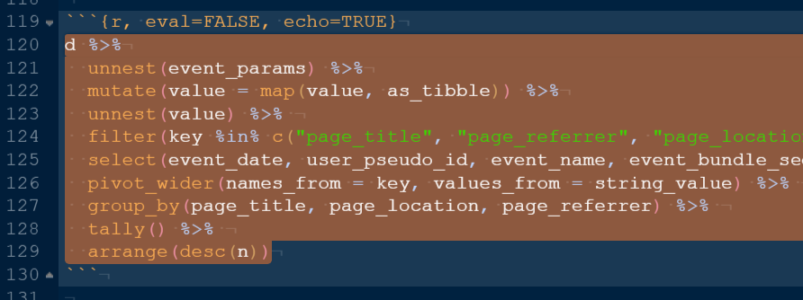
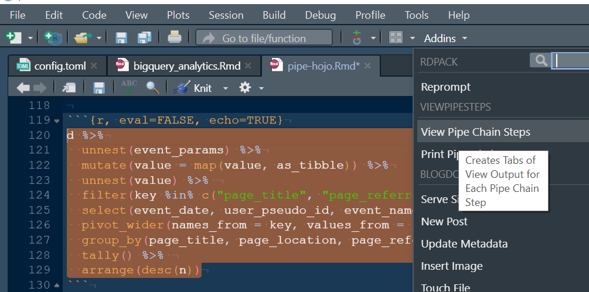
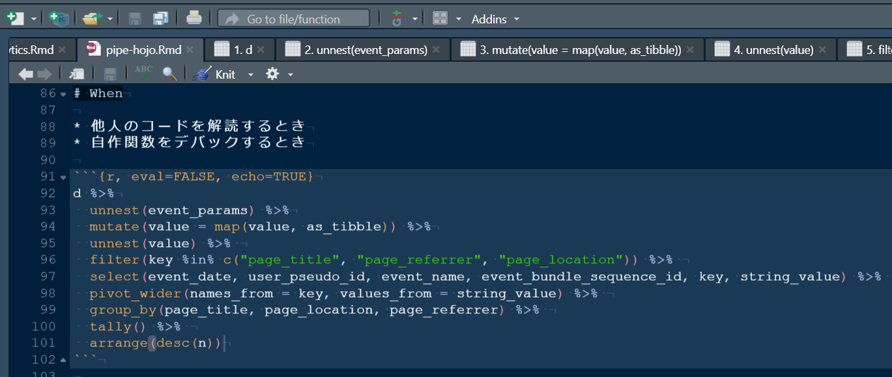
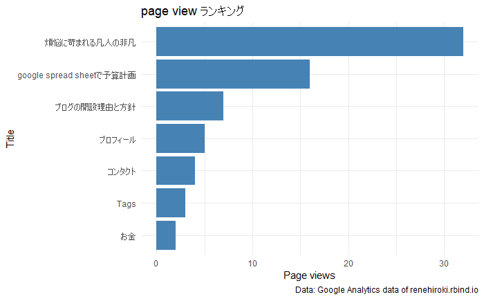
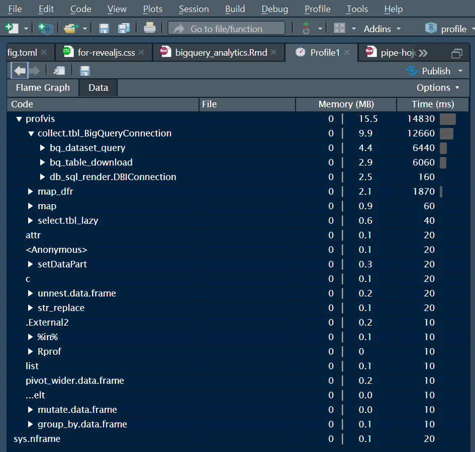
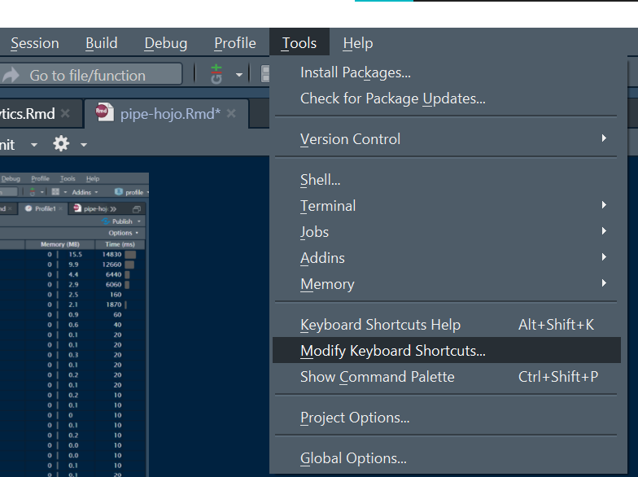
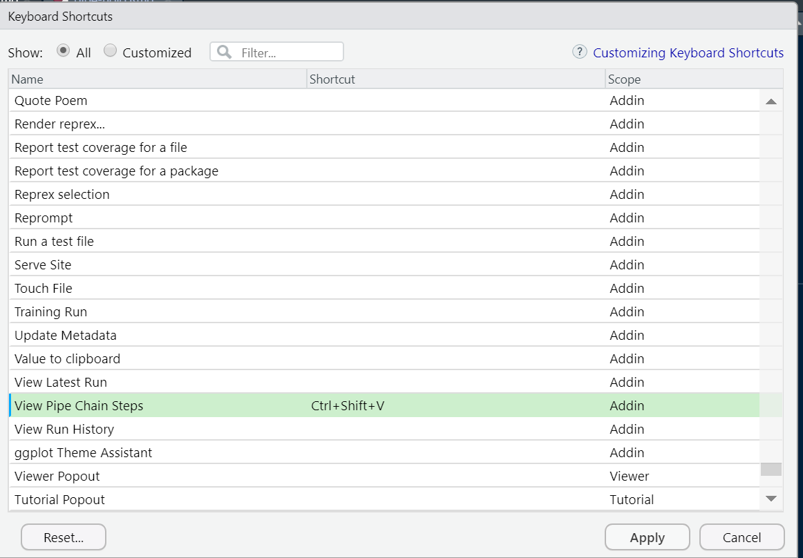

```{r include=FALSE}
knitr::opts_chunk$set(
  echo = FALSE,
  comment = "",
  cache = FALSE,
  warning = FALSE,
  message = FALSE,
  out.width = "100%",
  fig.pos = "H"
)
```


```{r, include=FALSE}
library(tidyverse)
d <- read_rds("sample_data.Rds")
```

# About Me

:::::: {.columns}
::: {.column width="65%"}

* 東京育ち滋賀加工、大阪出荷
* 日本初のデータサイエンス修士
* 製造業で1年目の新米会社員
* R歴は早3年近く
* データ整形と可視化が得意好き
* <a href="https://renehiroki.rbind.io/" target="_blank" rel="noopener noreferrer">Rといろいろblog</a>はじめました～

:::
::: {.column width="2%"}
:::
::: {.column width="30%"}

<figure class="pic-tomp"></figure>

<!-- Place this tag in your head or just before your close body tag. -->
<script async defer src="https://buttons.github.io/buttons.js"></script>

<a class="github-button" href="https://github.com/renehiroki" data-color-scheme="no-preference: dark; light: dark; dark: light;" aria-label="Follow @renehiroki on GitHub">Follow @renehiroki</a>
<a href="https://twitter.com/renehiroki?ref_src=twsrc%5Etfw" class="twitter-follow-button" data-show-count="false">Follow @renehiroki</a><script async src="https://platform.twitter.com/widgets.js" charset="utf-8"></script>

:::
::::::


# Today's Talk

* ViewPipeSteps
  * R初心者向け
  * %>%の流れをすべて見れる
* profvis
  * R中級者向け
  * プログラムのどこが早くてどこが遅いかを見れる


# ViewPipeSteps

# When

* 他人のコードを解読するとき
* 自作関数をデバックするとき

```{r, eval=FALSE, echo=TRUE}
d %>%
  unnest(event_params) %>%
  mutate(value = map(value, as_tibble)) %>%
  unnest(value) %>% 
  filter(key %in% c("page_title", "page_referrer", "page_location")) %>% 
  select(event_date, user_pseudo_id, event_name, event_bundle_sequence_id, key, string_value) %>%  
  pivot_wider(names_from = key, values_from = string_value) %>% 
  group_by(page_title, page_location, page_referrer) %>% 
  tally() %>% 
  arrange(desc(n))
```

# Video

<video controls>
  <source src="when.mp4" type="video/mp4">
</video>

# 


# How

１．ライブラリのインストール

```{r, echo=TRUE, eval=FALSE}
devtools::install_github("daranzolin/ViewPipeSteps")
library(ViewPipeSteps)
```

:::::: {.columns}
::: {.column width="48%"}

２．範囲を選択



:::
::: {.column width="2%"}
:::
::: {.column width="48%"}

３．addin<br>View Pipe Chain Steps



:::
::::::

# What

* %>% ごとにview()を実行してくれる

```{r, eval=FALSE, echo=TRUE}
d %>%
  unnest(event_params) %>%
  mutate(value = map(value, as_tibble)) %>%
  unnest(value) %>% 
  filter(key %in% c("page_title", "page_referrer", "page_location")) %>% 
  select(event_date, user_pseudo_id, event_name, event_bundle_sequence_id, key, string_value) %>%  
  pivot_wider(names_from = key, values_from = string_value) %>% 
  group_by(page_title, page_location, page_referrer) %>% 
  tally() %>% 
  arrange(desc(n))
```


# Video

<video controls>
  <source src="what.mp4" type="video/mp4">
</video>

# Result



# profvis


# When

* 実行速度が遅く、改善したいとき

```{r, eval=FALSE, echo=TRUE}
d <-
  tables %>% 
  map_dfr(collect_page_view_data, con) %>% 
  count_page_view()

d %>%
  modify_title() %>% 
  plot_page_view_ranking()
```

# 



# How

* profvis({})で囲んで実行する

```{r, eval=FALSE, echo=TRUE}
profvis({
  d <-
    tables %>% 
    map_dfr(collect_page_view_data, con) %>% 
    count_page_view()
  
  d %>%
    modify_title() %>% 
    plot_page_view_ranking()
})
```


# What

* 実行速度やメモリの使用量がわかる




# Appendix

ToolsタブのModify Keyboard Shortcuts...より、ViewPipeStepsを設定（たとえばCtrl + Shift + V）することもできる

:::::: {.columns}
::: {.column width="48%"}



:::
::: {.column width="2%"}
:::
::: {.column width="48%"}



:::
::::::


# Reference

* Rbloggers
  * [Antoine Soetewey, "RStudio addins, or how to make your coding life easier", January 25, 2020](https://www.r-bloggers.com/2020/01/rstudio-addins-or-how-to-make-your-coding-life-easier-2/#google_vignette) 
  * [mira céline klein, "Code performance in R: Which part of the code is slow?", April 26, 2021](https://www.r-bloggers.com/2021/04/code-performance-in-r-which-part-of-the-code-is-slow/)


# Enjoy！

